# 🛍️ Torilo Shop - Django E-Commerce Project

## Project Description

**Torilo Shop** is a beginner-friendly Django e-commerce web application built to demonstrate core Django concepts, data modeling, and modern web development practices. It includes a complete product catalog system with categories, allowing users to browse items with a professional, responsive interface.

### Visual & Admin Improvements Made

**Visual Improvements:**
- Custom CSS styling with gold accent colors (#d4af37)
- Product card hover effects with lift animation
- Enhanced search form with shadow effects
- Responsive design for mobile devices
- Thumbnail images on product list page
- Full-size images on product detail page

**Admin Improvements:**
- Custom list_display showing name, price, category, stock, is_available
- Search_fields on product name and category name
- list_filter by category and is_available
- Custom bulk action: "Mark as out of stock"
- ImageField support for product images

The project now includes the following models:
- `Category`: stores product categories with `name`, `slug`, and optional `description`
- `Product`: stores products with `name`, `price`, `stock`, `category`, `image`, `is_available`, and `created_at`

## Features Implemented

### 1. Custom CSS Styling
- **File**: `static/css/styles.css`
- Gold accent color (#d4af37) for prices and highlights
- Product card hover effects with transform animation
- Enhanced search form with rounded corners and shadow
- Responsive design for mobile devices

### 2. ImageField for Products
- **Model**: `Product.image` (ImageField)
- Thumbnail display (200px height) on product list page
- Full-size image display (up to 400px) on product detail page
- Images stored in `media/products/` directory

### 3. Admin Customisations
- **list_display**: `name`, `price`, `category`, `stock`, `is_available`
- **search_fields**: `name`, `category__name`
- **list_filter**: `category`, `is_available`, `created_at`
- Media URL configuration for serving uploaded images

### 4. Custom Bulk Action
- **Action**: "Mark as out of stock"
- Sets `stock=0` and `is_available=False` for selected products
- Displays success message with count of updated products

### Template System
- **base.html**: Bootstrap-powered base template with responsive navbar and footer
- **Template Inheritance**: All pages extend base.html using `` and ``
- **Django Template Language (DTL)**:
  - `` loops for product listings
  - `` conditions for stock status badges
  - `` tags for navigation
  - Template filters (`|date`, `|pluralize`)

### Views & Pages
- **home**: Welcome page with navigation and promotional content
- **product_list**: Displays all products in a responsive card grid with stock badges
- **product_detail**: Shows individual product details (name, price, stock, category, date)
- **category_list**: Lists all categories with product counts
- **category_products**: Shows products filtered by specific category
- **about**: Company information page

### ORM Operations Performed
- `Product.objects.all()` — View all products
- `Product.objects.filter(category__name='Electronics')` — Filter products by category name
- `cat = Category.objects.get(name='Electronics')`
  `Product.objects.filter(category=cat)` — Filter by a category object
- `Product.objects.filter(price__gt=5000)` — Products with price greater than 5000

### URL Routes
| URL | View | Purpose |
|-----|------|---------|
| `/` | home() | Home page with welcome content |
| `/products/` | product_list() | Products listing with stock badges |
| `/products/<int:pk>/` | product_detail() | Individual product details |
| `/categories/` | category_list() | Category overview with product counts |
| `/categories/<slug>/` | category_products() | Products filtered by category |
| `/about/` | about() | About page with company information |

### Apps Registered
- `products` - Main commerce app containing views, models, admin, and URLs
- `users` - User management app (placeholder for future development)


## Setup Instructions

### Step 1: Create Virtual Environment
```bash
# Navigate to the project directory
cd module-9/toriloshop

# Create a virtual environment
python -m venv venv

# Activate the virtual environment
# On Windows:
.\venv\Scripts\Activate.ps1
# On macOS/Linux:
source venv/bin/activate
```

### Step 2: Install Dependencies
```bash
pip install django
pip install Pillow
```

### Step 3: Create and Apply Migrations
```bash
python manage.py makemigrations
python manage.py migrate
```

### Step 4: Collect Static Files
```bash
python manage.py collectstatic --noinput
```

### Step 5: Create Superuser for Admin
```bash
python manage.py createsuperuser
```

### Step 5: Run the Development Server
```bash
python manage.py runserver
```

Open the app at: **http://127.0.0.1:8000/**

### Step 6: Access the Admin Panel
Open: **http://127.0.0.1:8000/admin/**

### To Stop the Server
Press `CTRL + C` in the terminal

## Project Structure
module-11---screenshot---toriloshop---venv---

## Screenshots

<!-- ### Home Page
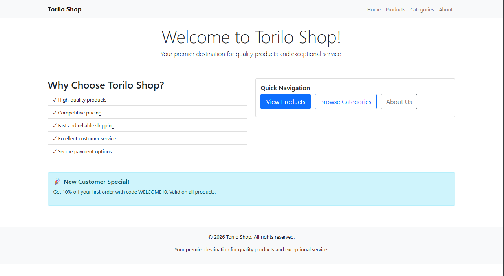

### Product List
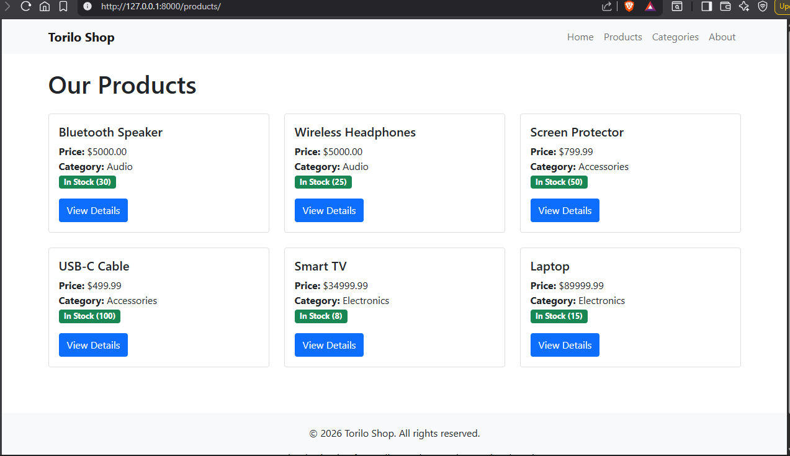

### Product Detail Page
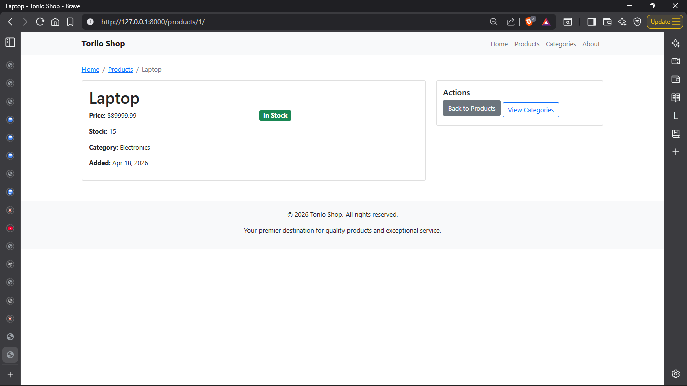

### Category List
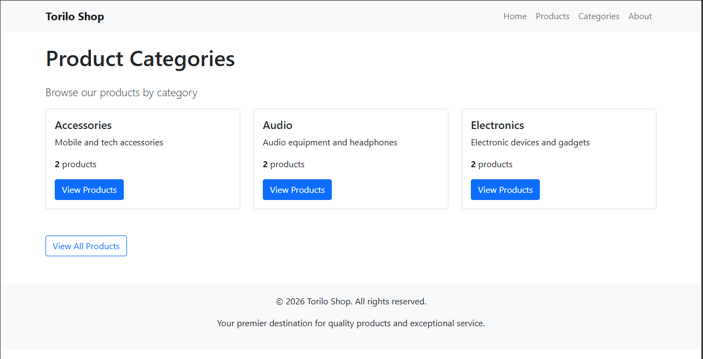

### About Page
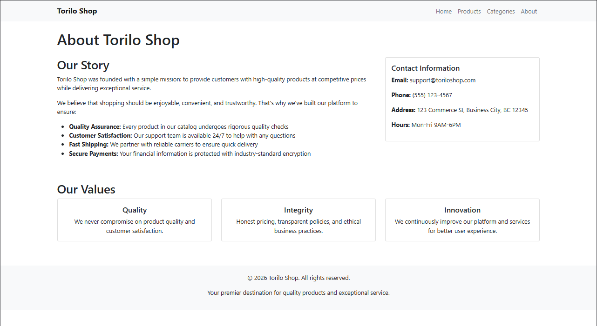

### Admin - Category List
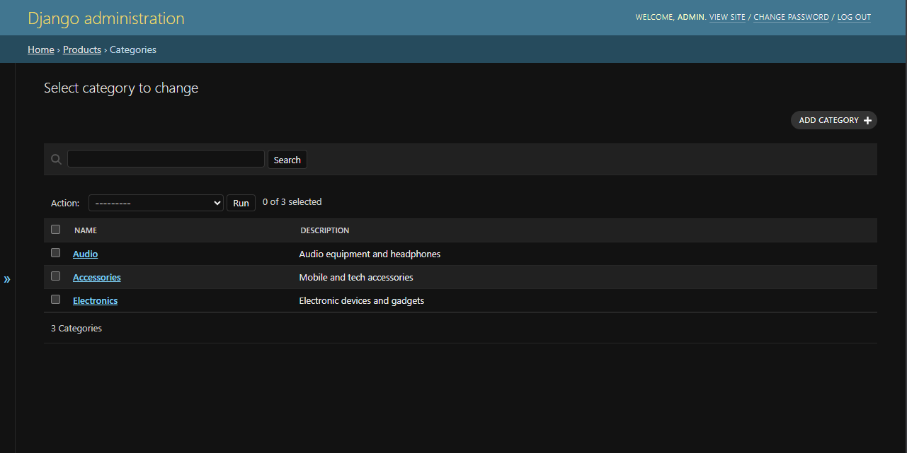

### Admin - Product List
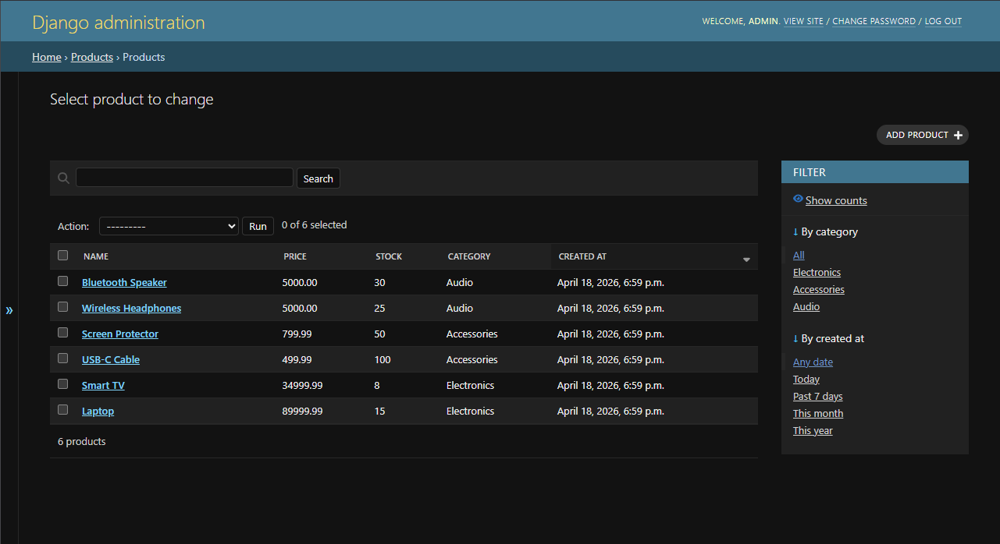

### Shell - All Products
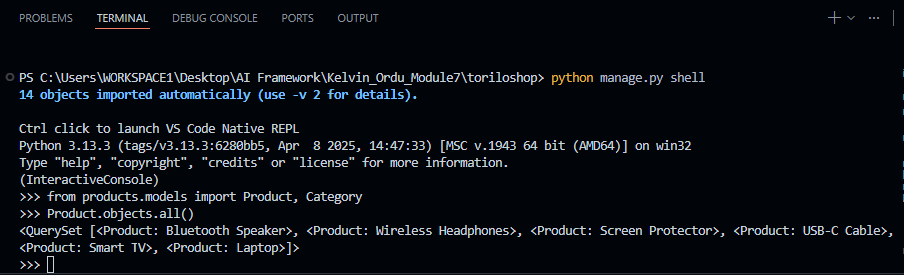

### Shell - Filter by Category
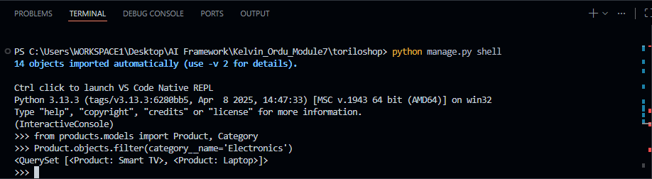

### Shell - Filter by Price
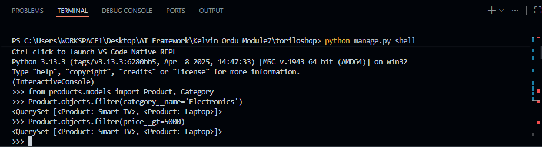

### Migration Success
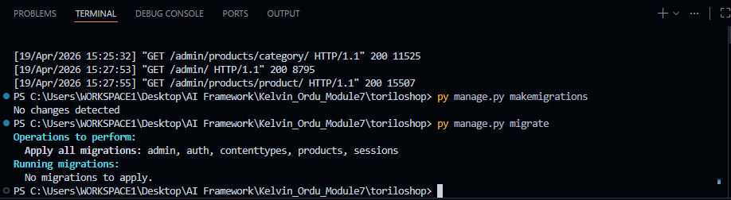 -->


## Key Files

### settings.py
- Location: `toriloshop/settings.py`
- Registered apps: `'products'` and `'users'`
- DEBUG mode enabled for development
- Templates configured with APP_DIRS for app-level templates

### products/views.py
Contains six view functions:
- `home()` - Renders home page template with welcome content
- `product_list()` - Queries all products and renders product catalog
- `product_detail()` - Shows individual product details with category info
- `category_list()` - Lists all categories with product counts
- `category_products()` - Filters and displays products by category
- `about()` - Renders about page with company information

### products/urls.py
Maps URLs to views with dynamic parameters:
```python
path('', views.home, name='home')
path('products/', views.product_list, name='product_list')
path('products/<int:pk>/', views.product_detail, name='product_detail')
path('categories/', views.category_list, name='category_list')
path('categories/<slug:slug>/', views.category_products, name='category_products')
path('about/', views.about, name='about')
```

### products/templates/products/base.html
Base template with Bootstrap CDN, responsive navbar, and footer. All other templates extend this.

### toriloshop/urls.py
Root URL configuration that includes products app URLs

## Technologies Used

- **Python 3.x**
- **Django 6.0.4**
- **SQLite** (default database)
- **Bootstrap 5.1.3** (CSS framework for responsive design)
- **HTML5** and **Django Template Language (DTL)**

## Learning Topics Covered

✅ Django project structure  
✅ Creating Django apps  
✅ Function-based views  
✅ URL routing with `path()` and dynamic parameters  
✅ Database models with relationships (ForeignKey)  
✅ Django ORM queries and filtering  
✅ Template inheritance with `` and ``  
✅ Django Template Language (DTL) - loops, conditionals, filters  
✅ Bootstrap CSS framework integration  
✅ Responsive web design  
✅ Admin interface configuration  
✅ Navigation between pages with URL reversing  
✅ Custom error handling (404)  
✅ Using INSTALLED_APPS configuration  

## Notes

- This is a development server and should NOT be used in production
- The application uses Django templates with Bootstrap for responsive design
- Database models are fully implemented with relationships
- Static files are served via Bootstrap CDN
- All pages are mobile-responsive with Bootstrap grid system

## Future Enhancements

- Implement user authentication and registration
- Add shopping cart functionality
- Integrate payment processing
- Add product search and filtering
- Implement user reviews and ratings
- Add product image uploads
- Create REST API endpoints
- Add email notifications
- Implement caching for performance
- Add unit and integration tests

## Author

Created as an educational Django learning project for Module 9

---

**Happy Learning!!! 🚀**
