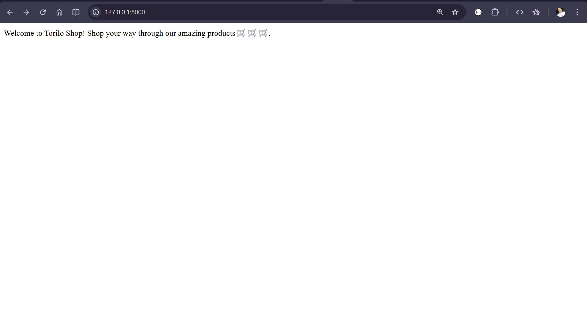
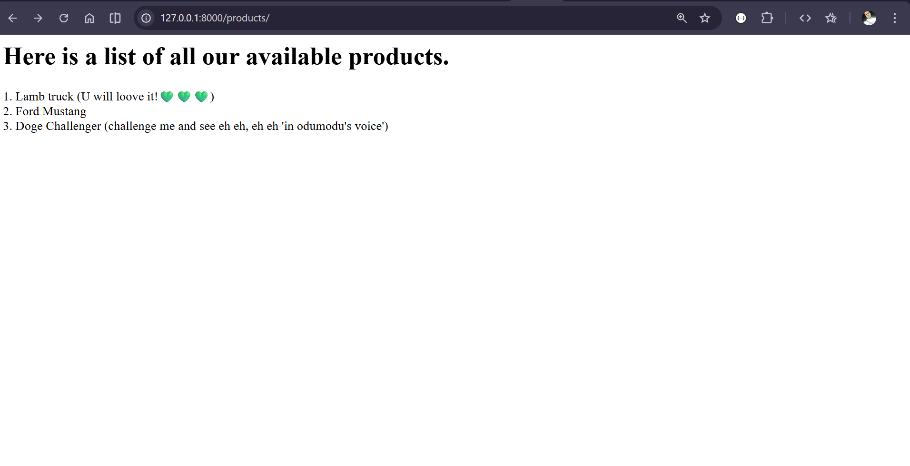
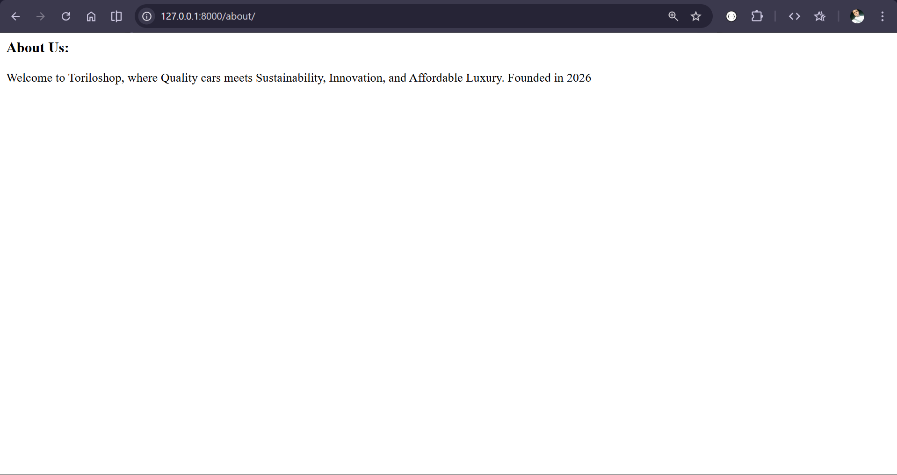
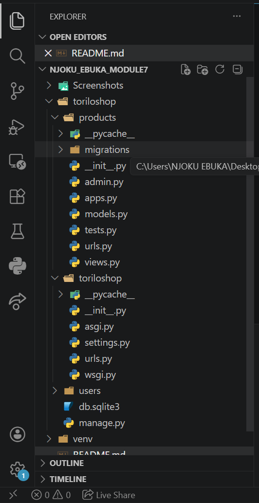
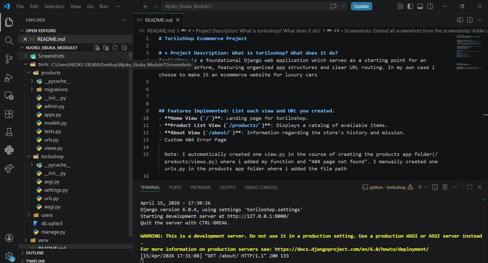
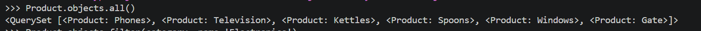

# ToriloShop Ecommerce Project

# • Project Description: What is toriloshop? What does it do?
ToriloShop is a foundational Django web application which serves as a starting point for an ecommerce platform, featuring organized app structures and clear URL routing. In my own case i choose to make it an ecommerce website for luxury cars

## Features Implemented: List each view and URL you created.
- **Home View (`/`)**: Landing page for toriloshop.
- **Product List View (`/products/`)**: Displays a catalog of available items.
- **About View (`/about/`)**: Information regarding the store's history and mission.
- Custom 404 Error Page

  Note: I automatically created one view.py in the course of creating the products app folder(/products/views.py) where i added my function and "404 page not found". I manually created one urls.py in the products app folder where i added the file path 

## Setup Instructions: Step-by-step guide to run the project locally (venv, pip install, runserver).
1. Create a virtual environment using: `python -m venv venv`
2. Activate the Environment using: `venv\Scripts\activate`
3. Install Django using: `pip install django`
4. Run the Server: `python manage.py runserver`
5. Access the site at `http://127.0.0.1:8000/`

## README.md Requirements
### • Screenshots: Embed all screenshots from the screenshots/ folder using Markdown image syntax.

# Project Screenshots

**Home Page**
   

**Products Page**

  

**About**

**Project Structure 1**

**Project Structure 2**

# Project Model
The project currently has two main models:

Category – to group products
Product – to store product details

This helps me understand how relationships work in Django, especially using ForeignKey.

# Features Implemented
1. Category Model

This model is used to store different product categories.

Fields:
name – stores the name of the category
description – optional field for more details

# Things I did with it (ORM):
Created new categories
Viewed all categories
Filtered categories
Deleted categories

2. Product Model: This model stores information about products.

# Fields:
name – product name
price – product price
stock – number of items available
category – links each product to a category
created_at – automatically stores when the product was created

Things I did with it (ORM):
Added new products
Viewed all products
Filtered products by category
Updated product details (like price and stock)
Deleted products
🛠️ Setup Instructions

# Steps to run the project on your system:
1. Create a virtual environment
python -m venv venv
2. Activate it
Windows:
venv\Scripts\activate
Mac/Linux:
source venv/bin/activate
3. Install Django
pip install django
4. Run migrations
python manage.py makemigrations
python manage.py migrate
5. Create a superuser
python manage.py createsuperuser
6. Start the server
python manage.py runserver

# Screenshots

