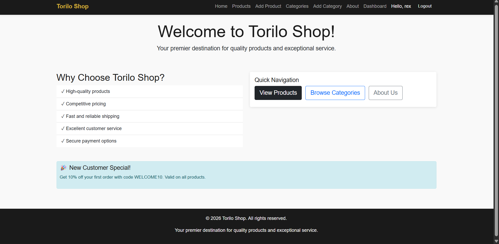
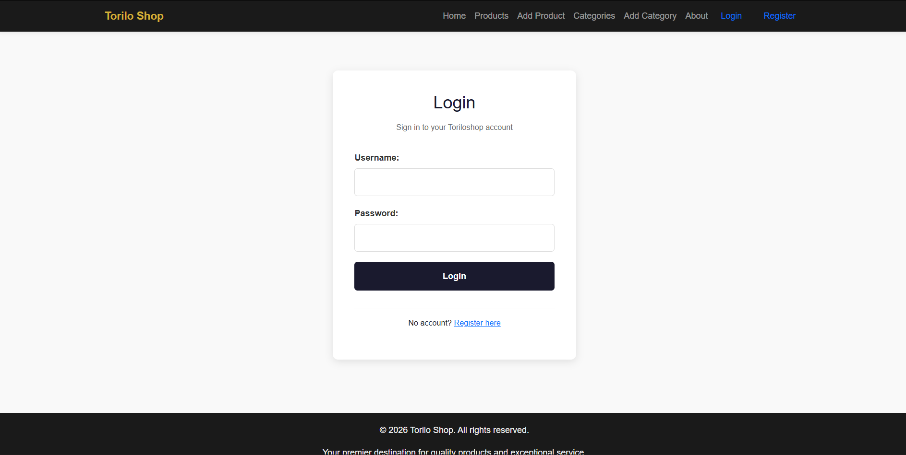
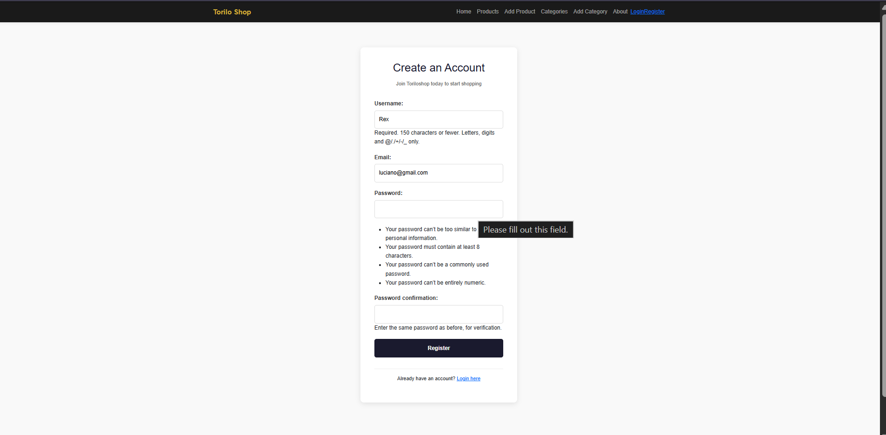

# 🛍️ Torilo Shop - Django E-Commerce Project

## Project Description

Torilo Shop is a Django e-commerce website. It lets users browse products organized by categories. The site has user login and registration, so people can create accounts. Staff members can add, edit, and delete products and categories through the website.

## Features Implemented

- User registration and login system
- Protected pages that only staff can access
- Product and category management for staff
- User dashboard to see account info
- Updated navigation bar that changes based on login status

## Setup Instructions

1. Create a virtual environment:

   python -m venv venv

2. Activate the virtual environment:
   - Windows: `venv\Scripts\activate`
   - Mac/Linux: `source venv/bin/activate`

3. Install required packages:

   pip install django pillow

4. Go to the project folder:

   cd toriloshop

5. Set up the database:

   python manage.py makemigrations
   python manage.py migrate

6. Create an admin user:

   python manage.py createsuperuser

7. Start the website:

   python manage.py runserver

8. Open your browser and go to: http://127.0.0.1:8000/

## Screenshots

